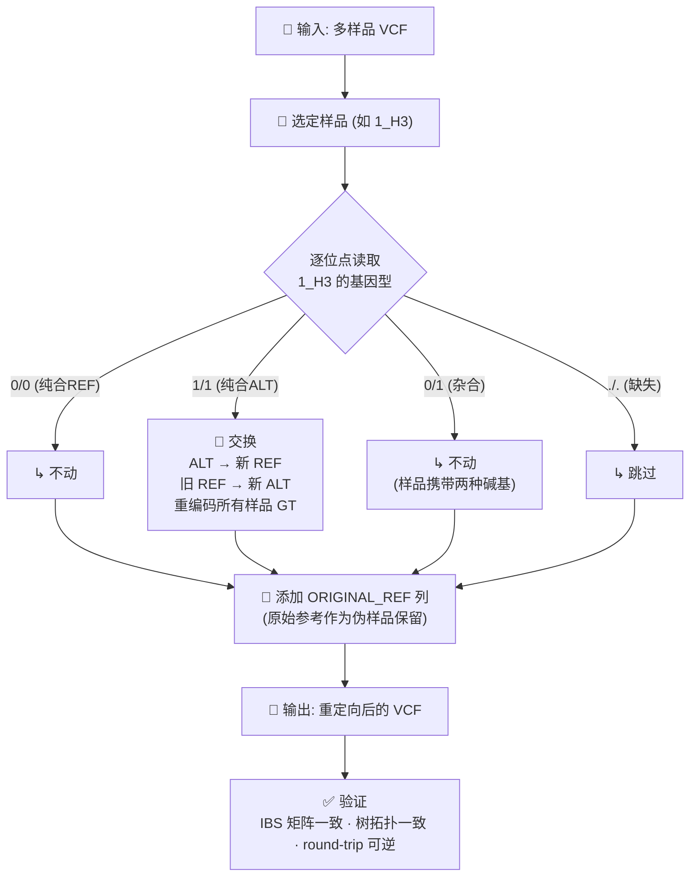

# liftVcf — 以指定样品为参照重新定向多样品 VCF

**以选定样品的基因型为参照，重新定向 VCF 的 REF/ALT 等位基因。** 原始参考基因组作为一个额外样品列保留。

> [English](README.md)

## 快速开始

```bash
# 1. 看一眼有哪些样品
python3 -c "import gzip; f=gzip.open('toy.vcf.gz','rt');
[print(l.split()[9]) for l in f if l.startswith('#CHROM')]; break"

# 2. 选一个样品，run（不需要任何额外参数）
python3 liftVcf.py toy.vcf.gz --sample 1_H3

# 3. 验证正确性（距离矩阵 + 树拓扑 + round-trip）
python3 verify_swap.py toy.vcf.gz --swap --sample 1_H3
```

## 工作流程



## 它做了什么？

假设你选了样品 `1_H3`，对每个变异位点：

| 1_H3 的基因型 | 含义 | 结果 |
|---|---|---|
| `0/0` | 和参考一样 | 不动 |
| `1/1` | 纯合突变 | **交换**：突变碱基 → 新 REF，原 REF → 新 ALT |
| `0/1` | 杂合（两种碱基都有） | 不动：样品自己都不确定 |
| `./.` | 缺失 | 跳过 |

定向后 VCF 多出一列 `ORIGINAL_REF`——原始参考基因组作为一个样品保留。

## 不需要参数

```bash
python3 liftVcf.py input.vcf.gz --sample 样品名
```

## 可选参数：控制杂合位点行为

默认杂合位点不动。以下参数可以改变这一行为：

| 参数 | 策略 | 适用场景 |
|------|------|----------|
| （不加） | 杂合位点不动 | **默认，适用于绝大多数场景** |
| `--force` | 按测序深度选主等位基因做 REF | 想尽可能多交换位点（启发式，不推断相位） |
| `--iupac` | 用 IUPAC 歧义碱基（A/G→R） | [实验性] 产出非标准 VCF，慎用 |

## 输出

- 文件名自动生成：`toy_ref-1_H3.vcf.gz`（`<输入>_ref-<样品名>.vcf.gz`）
- VCF header 记录用哪个样品：`##swapRef_Sample=<ID=1_H3,...>`
- PL 字段始终丢弃（等位基因重排后不再有效），可用 `bcftools +fill-tags` 恢复

## 验证原理

等位基因重编码是双射（一一映射），样品间的等位基因共享关系不变：

- **IBS 距离矩阵**完全一致（相关系数 = 1.0）
- **树拓扑结构**完全一致（cophenetic 相关系数 = 1.0）
- **Round-trip**：swap → 反向 swap → 原始 VCF 精确还原

`verify_swap.py` 自动完成以上三项检查。

## 重要：这不是基因组 Liftover

本工具重新定向的是 **VCF 等位基因定义**，不改动基因组坐标。它**不会**：

- 改变 CHROM、POS 坐标系
- 生成新的 FASTA 序列
- 重新比对 reads 或重新 calling

跨参考基因组的坐标转换请用 CrossMap、Picard LiftoverVcf 或 bcftools + chain。

## 全部参数

```
python3 liftVcf.py input.vcf.gz \
    --sample SAMPLE        # 必填：作为参照的样品名
    -o output.vcf.gz       # 输出文件（默认自动命名）
    --force                # 可选：杂合位点按 AD 深度选主等位基因（启发式）
    --iupac                # 可选：[实验性] 杂合位点用 IUPAC 歧义碱基
    --new-sample-name NAME # 原始参考列名（默认 ORIGINAL_REF）
    -q                     # 安静模式
```
